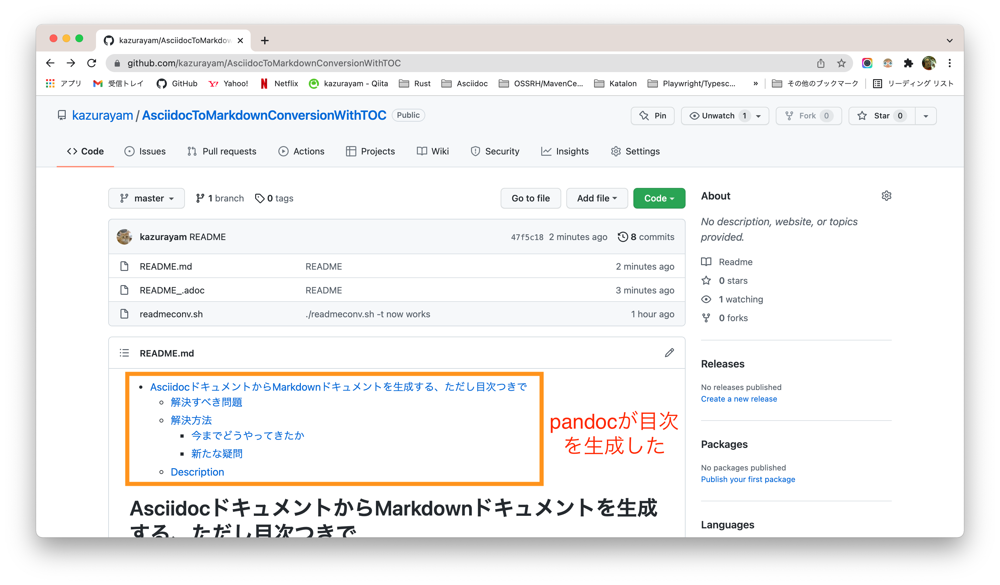

-   [目次つきのREADMEを作る ただしローカルでAsciidocからMarkdownへ変換する方法で](#_目次つきのreadmeを作る_ただしローカルでasciidocからmarkdownへ変換する方法で)
    -   [Problem to solve](#_problem_to_solve)
    -   [Solution](#_solution)
        -   [My previous solution](#_my_previous_solution)
        -   [従来の方法の課題](#_従来の方法の課題)
    -   [Description of my new solution](#_description_of_my_new_solution)

# 目次つきのREADMEを作る ただしローカルでAsciidocからMarkdownへ変換する方法で

kazurayam
v0.1, 2022-01-23

## Problem to solve

GitHubプロジェクトを自作したらREADMEドキュメントをかならず書く。READMEドキュメントはMarkdownの構文で書くのが普通だ。Markdownはシンプルで短い説明を書くにはとても使いやすいが、長い文章を書くにはいささか非力だ。特にプログラムのソースコードをそのままREADMEに引用することができないので、いちいちコピペしなければならないのがつらい。

ネットをあちこち調べて Asciidocの構文でREADMEの原稿を書いてMarkdownに変換する方法を見つけた。そのスクリプトは下記のURLに公開されていたものだ。

-   <https://github.com/github/markup/issues/1095> 9th June 2021に chevdoor が投稿したコード

…​と言うことを以前私はQiitaに投稿した。

-   <https://qiita.com/kazurayam/items/361fdcd6846bba7bd03a>

さてAsciidocでドキュメントの原稿を書いてMarkdownに変換したものをpublishするやり方はとても楽なので、ついつい長くて懇切丁寧な文章を書いてしまう。すると目次 (Table of contents) が欲しくなる。TOCを自動的に作りたいがどうやればいいか？

## Solution

### My previous solution

GitHubで公開するREADMEドキュメントにTOCを自動的につける方法がネット上にいくつも提案され実用されている。わたしも下記のツールを何年も使ってきた。

-   <https://github.com/technote-space/toc-generator>

このツールはちゃんと動くし便利だ。このツールは GitHub Action として動作する。

### 従来の方法の課題

前述のツールを使っていて不便に思う場面があった。わたしがREADME.mdファイルを編集してgit addしてgit commitしてgit pushする。するとpushのインベントを受けてGitHub Actionが起動され、README.mdファイルにTOCを挿入する。するとリモートレポジトリの中に格納されたREADME.mdファイルはわたしの手元にあるREADME.mdよりも1回分コミットが進んだ状態になる。だから私は次にREADME.mdを編集する前にgit pullしなければならない。さもないとローカルのREADME.mdファイルとリモートのREADME.mdファイルが同期しなくなってあとでmerge conflictが発生する。いったん発生したconflictをもみ消す作業はなかなか厄介だ。

ちょっと待てよ。わたしはAsciidocで原稿を書いてそれを入力としてMarkdownを生成するというアクションをbashシェルスクリプトとして記述し、手元のPC上で実行している。ならば目次を生成するのをローカルで実行できるのではないか？GitHub Actionに頼るのではなく。

調べたら出来ました。

## Description of my new solution

bashシェルスクリプト `readmeconv.sh` を次のように修正した

    #!/usr/bin/env bash

    # Convert all the files with name ending with `*.adoc` into `*.md`.
    # `*.adoc` is an Asciidoc document file, `*.md` is a Mardown document file.
    # E.g, `readme_.adoc` will be converted into `readme_.md`
    # Except ones with `_` as prefix.
    # E.g, `_readme.adoc` is NOT processed by this script, will be left unprocessed.
    #
    # How to active this: in the command line, just type 
    # `> ./readmeconv.sh`
    #
    # Can generate Table of content in the output *.md file by specifying `-t` option
    # `> ./readmeconv.sh -t`

    requireTOC=false

    optstring="t"
    while getopts ${optstring} arg; do
        case ${arg} in
            t)
                requireTOC=true
                ;;
            ?)
                ;;
        esac
    done

    find . -iname "*.adoc" -type f -maxdepth 1 -not -name "_*.adoc" | while read fname; do
        target=${fname//adoc/md}
        xml=${fname//adoc/xml}
        echo "converting $fname into $target"
        # converting a *.adoc into a docbook
        asciidoctor -b docbook -a leveloffset=+1 -o - "$fname" > "$xml"
        if [ $requireTOC = true ]; then
          # generate a Markdown file with Table of contents
          cat "$xml" | pandoc --standalone --toc --markdown-headings=atx --wrap=preserve -t markdown_strict -f docbook - > "$target"
        else
          # without TOC
          cat "$xml" | pandoc --markdown-headings=atx --wrap=preserve -t markdown_strict -f docbook - > "$target"
        fi
        echo deleting $xml
        rm -f "$xml"
    done

    # if we find a readme*.md (or README*.md), 
    # we rename all of them to a single README.md while overwriting,
    # effectively the last wins.
    # E.g, if we have `readme_.md`, it will be overwritten into `README.md`
    find . -iname "readme*.md" -not -name "README.md" -type f -maxdepth 1 | while read fname; do
        echo Renaming $fname to README.md
        mv $fname README.md
    done

pandocコマンドに `--standalon --toc` というオプションを指定することが肝心。

コマンドラインで\`readmeconv.sh\`を実行するとき、\`-t\`オプションを付けるとTOCが生成されて\`README.md\`ファイルの先頭に挿入される。

    $ ./readmeconv.sh -t

もちろん `-t` オプションを指定しなれば従前通りTOC無しで\`README.md\`ファイルが生成される。

    $ ./readmeconv.sh
